# 🏦 SmartLend – Credit Risk & Loan Portfolio Analytics Dashboard

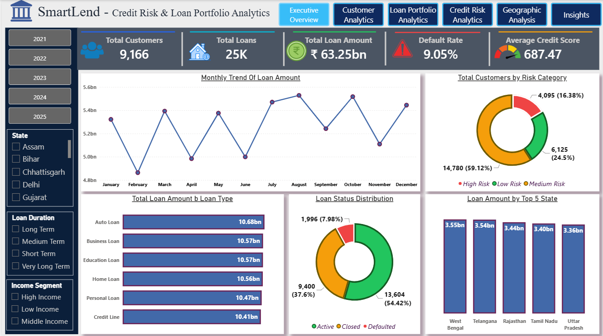

## 📌 Project Overview

SmartLend is an end-to-end Credit Risk & Loan Portfolio Analytics solution designed to help financial institutions monitor portfolio performance, identify high-risk borrowers, analyze customer behavior, evaluate geographic exposure, and support strategic lending decisions.

The project combines SQL, Python, and Power BI to transform raw lending data into actionable business insights and executive-level reporting.

---

## 🎯 Business Problem

Financial institutions face several challenges:

* Rising loan defaults
* Increasing credit risk exposure
* Inefficient customer segmentation
* Lack of visibility into regional performance
* Difficulty identifying profitable lending opportunities

The objective of this project is to build an analytical solution that enables stakeholders to:

✔ Monitor portfolio health

✔ Track default risk

✔ Identify high-risk customers

✔ Evaluate loan product performance

✔ Improve lending strategies

✔ Support executive decision-making

---

## 🛠️ Technology Stack

| Technology | Purpose                                         |
| ---------- | ----------------------------------------------- |
| SQL        | Data Extraction & Business Analysis             |
| Python     | Data Cleaning, Validation & Feature Engineering |
| Pandas     | Data Transformation                             |
| NumPy      | Data Processing                                 |
| Power BI   | Dashboard Development                           |
| DAX        | KPI & Measure Creation                          |
| Excel/CSV  | Data Source                                     |

---

# 🔄 Project Workflow

## 1️⃣ Database Design & Data Preparation

Created a structured loan portfolio dataset and prepared customer, loan, and risk-related information for analysis.

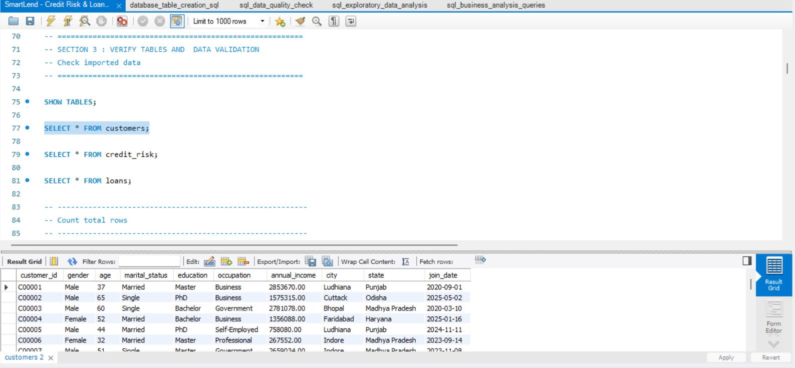

---

## 2️⃣ Data Quality Validation

Performed:

* Missing Value Analysis
* Duplicate Detection
* Data Validation Checks
* Data Consistency Verification

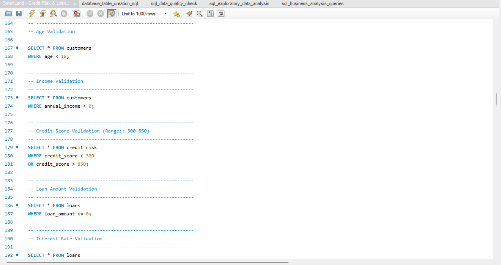

---

## 3️⃣ Python Processing & Feature Engineering

Developed business-focused features including:

* Age Groups
* Income Segments
* Credit Score Buckets
* Risk Categories
* Loan Duration Buckets

Performed Exploratory Data Analysis (EDA) to identify trends, patterns, and anomalies.

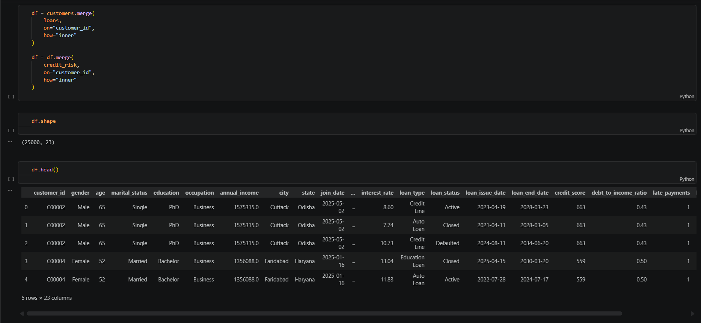
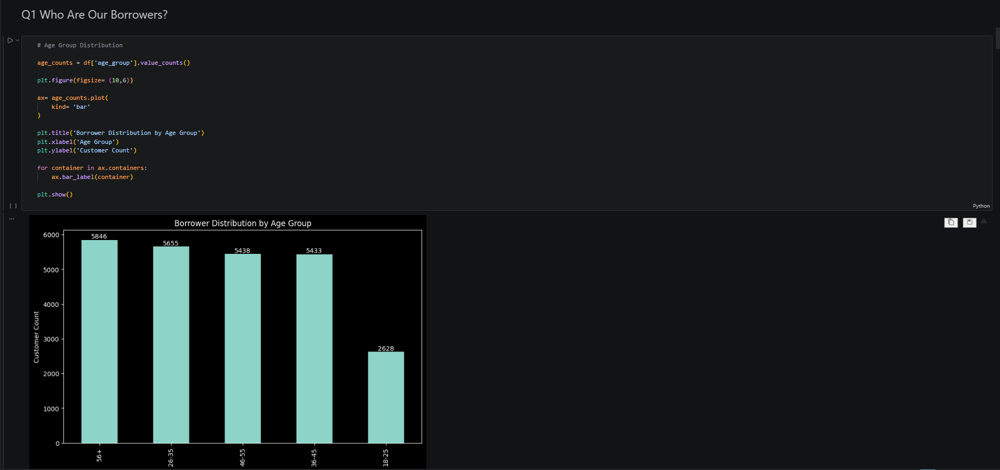
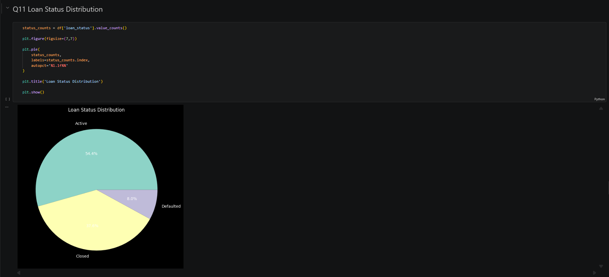

---

## 4️⃣ SQL Business Analysis

Performed 15+ analytical SQL queries covering:

### Customer Analytics

* Customer Segmentation
* Income Analysis
* Risk Distribution

### Loan Analytics

* Loan Portfolio Performance
* Loan Product Analysis
* Revenue Potential Analysis

### Credit Risk Analytics

* Default Rate Analysis
* Amount At Risk Analysis
* Credit Score Performance

### Geographic Analytics

* State-wise Exposure
* Regional Risk Concentration

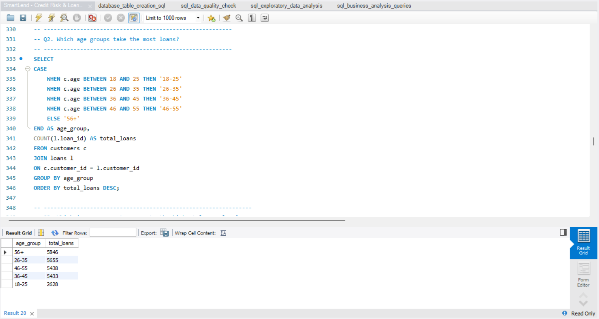
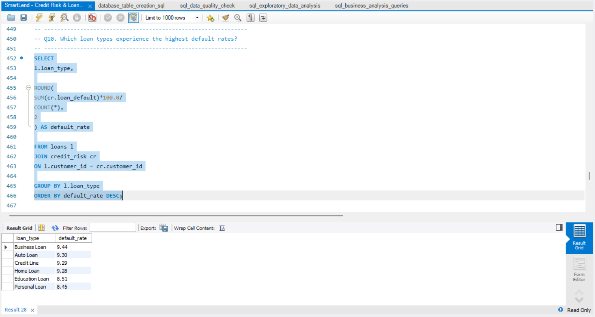

---

## 5️⃣ Power BI Dashboard Development

Designed an interactive executive dashboard consisting of six analytical pages.

---

# 📊 Dashboard Pages

## Executive Overview

Provides a high-level summary of portfolio performance, loan volume, risk exposure, and customer distribution.

---

## Customer Analytics

Analyzes customer demographics, income segments, occupations, age groups, and risk classifications.

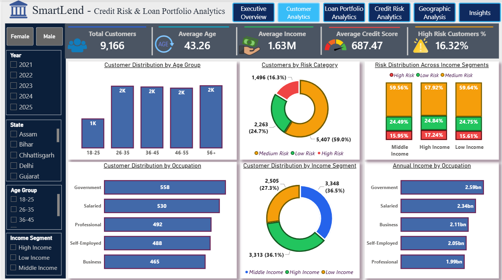

---

## Loan Portfolio Analytics

Evaluates loan performance, loan types, loan duration, loan status, and revenue potential.

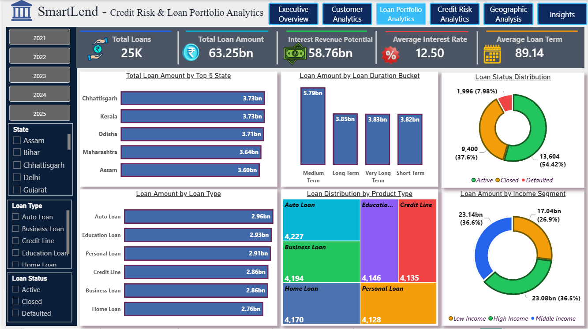

---

## Credit Risk Analytics

Tracks default trends, risk categories, amount at risk, and credit score performance.

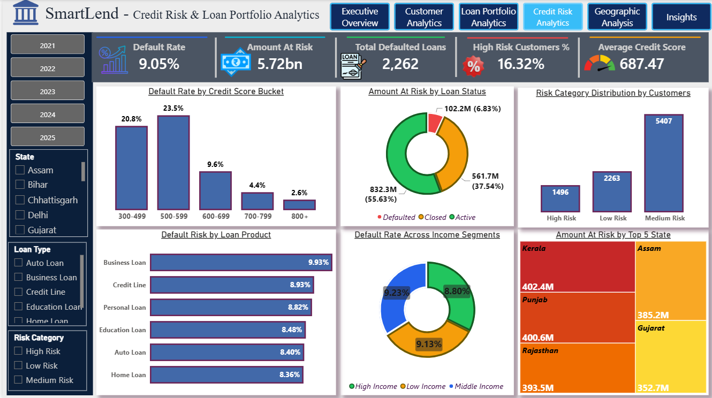

---

## Geographic & Regional Analysis

Highlights regional lending performance, state-wise exposure, customer concentration, and geographic risk distribution.

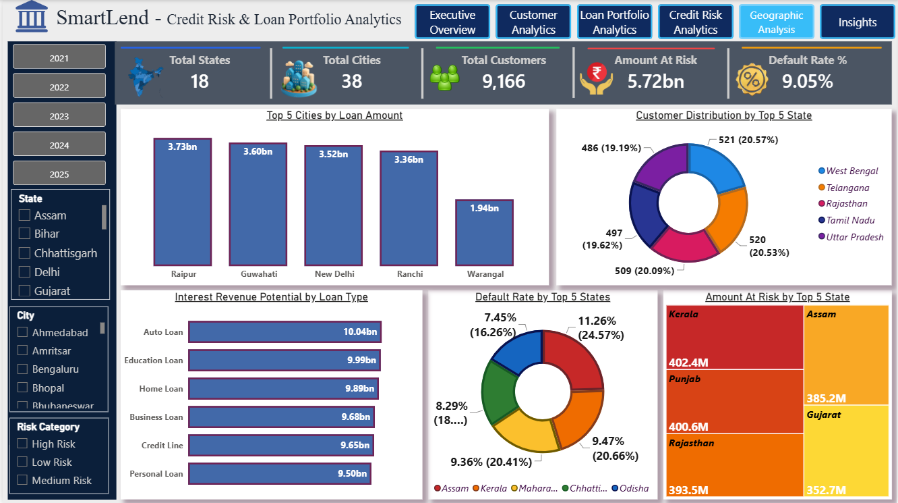

---

## Executive Insights & Strategic Recommendations

Converts analytical findings into business actions and executive recommendations.

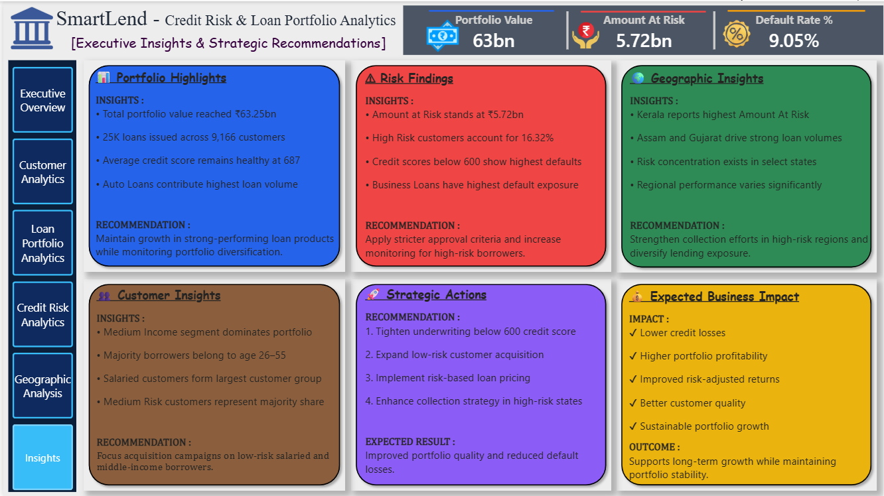

---

# 📈 Key Business Insights

### Portfolio Performance

* Total Loan Portfolio exceeded ₹63 Billion.
* More than 25,000 loans were issued across 9,166 customers.
* Average Credit Score remains healthy at approximately 687.

### Customer Insights

* Medium-risk customers represent the largest customer segment.
* Majority of borrowers belong to the working-age population.
* Salaried customers form one of the strongest customer groups.

### Credit Risk Findings

* High-risk customers account for over 16% of the portfolio.
* Credit scores below 600 show the highest default tendency.
* Business Loans exhibit elevated default exposure.

### Geographic Insights

* Risk exposure is concentrated within a limited number of states.
* Certain regions contribute significantly to portfolio value while simultaneously carrying elevated risk.

---

# 🚀 Strategic Recommendations

### Risk Management

* Strengthen underwriting for borrowers with credit scores below 600.
* Introduce enhanced monitoring for high-risk customer segments.
* Expand risk-based pricing models.

### Portfolio Optimization

* Increase lending to low-risk customer groups.
* Improve loan product diversification.
* Rebalance exposure across regions.

### Growth Strategy

* Focus customer acquisition on profitable and low-risk segments.
* Expand operations in high-performing regions.
* Strengthen collection strategies in high-risk areas.

---

---

# 🎓 Skills Demonstrated

* SQL Query Writing
* Data Cleaning
* Data Validation
* Exploratory Data Analysis
* Feature Engineering
* Business Intelligence
* Data Visualization
* Dashboard Development
* Credit Risk Analysis
* Loan Portfolio Analytics
* Business Storytelling
* Executive Reporting

---

## 👨‍💻 Author

**Sneh Parekh**

Aspiring Data Analyst | SQL | Python | Power BI

This project demonstrates end-to-end analytical capabilities, from data preparation and business analysis to dashboard development and executive decision support.
